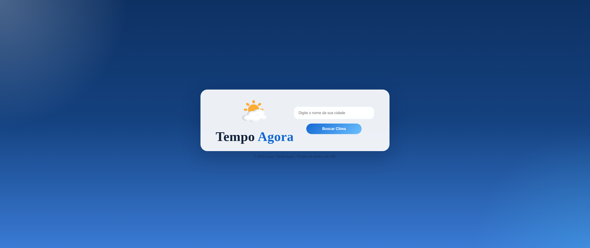

# TempoAgora 🌤️

Uma aplicação web simples que permite ao usuário buscar o clima de qualquer cidade em tempo real utilizando uma API de previsão do tempo.

## 📖 Descrição
O **TempoAgora** foi desenvolvido com foco em prática de JavaScript, manipulação do DOM e consumo de API.  
O objetivo é fornecer uma experiência rápida e intuitiva para que o usuário possa consultar a temperatura e outras informações meteorológicas da cidade desejada.  

O projeto também inclui tratamento de erros, garantindo que entradas inválidas não quebrem a aplicação.

## 🚀 Funcionalidades
- Buscar o clima por cidade
- Tratamento de erro para cidades não encontradas ou campo vazio
- Tela de resultados e botão de voltar para nova busca
- Validar entrada do usuário antes da busca
- Fazer requisição na API de previsão do tempo e retornar os dados
- Exibir os resultados de forma clara na tela
- Exibir mensagens de erro em caso de problemas
- Controlar a troca de telas entre busca e resultado
- Tela de loading

## 🛠 Tecnologias
- HTML, CSS e JavaScript puro
- API de previsão do tempo (ex: OpenWeatherMap)
- Manipulação do DOM
- Async/Await para requisições assíncronas

## 📸 Preview


## 📌 Status do projeto
Em desenvolvimento

## 💻 Instalação
Para rodar o projeto localmente:

```bash
# clone o repositório
git clone https://github.com/Lucas-Jardim-Gomes/App-de-Clima

# entre na pasta do projeto
cd App-de-Clima


# abra o arquivo index.html no navegador
# ou use um servidor local como Live Server
```

